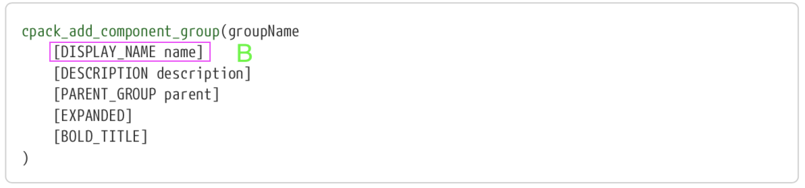

# CPack 入门指南

修改于2020-05-19 17:38:27阅读 1.2K0


## 背景

CPack 是 CMake 2.4.2 之后的一个内置工具，用于创建软件的二进制包和源代码包。

CPack 在整个 CMake 工具链的位置。


CPack 支持打包的包格式有以下种类：

- 7Z (7-Zip file format)
- DEB (Debian packages)
- External (CPack External packages)
- IFW (Qt Installer Framework)
- NSIS (Null Soft Installer)
- NSIS64 (Null Soft Installer (64-bit))
- NuGet (NuGet packages)
- RPM (RPM packages)
- STGZ (Self extracting Tar GZip compression
- TBZ2 (Tar GZip compression)
- TXZ (Tar XZ compression)
- TZ (Tar Compress compression)
- ZIP (ZIP file format)

## 为什么要用打包工具

软件程序想要在生产环境快速被使用，就需要一个一键安装的安装包，这样生产环境就可以很方便的部署和使用。

## 选择 CPack 的原因

C++ 工程大部分都是用 CMake 配置编译， 而 CPack 是 CMake 内置的工具，支持打包成多种格式的安装包。因为是 CMake 的内置工具，所以使用的方式也是通过在 CMakeLists.txt 配置参数，就能达到我们的需求。使用起来很方便，容易上手。

## 如何安装 CPack

安装 CMake 的时候会把 CPack 一起安装了，直接通过 yum 或者 apt-get 安装即可。

## 一个简单的例子

### 基础配置

这里介绍如何打包 rpm 包，deb 的打包是一样的，区别在于一些配置。Cpack 打包 rpm 用的是 CPack RPM 生成器，用到的配置变量是以 CPACK_RPM_XXX 为前缀。最终通过 **rpm-build** 这个工具去打包，所以需要安装 **rpm-build** 这个工具，可以通过 `sudo yum install -y rpm-build` 安装。下面配置是用 3.14.5 的 CMake 进行测试的。

现在有一个工程 example，其目录结构如下：

```js
example
	|-- CMakeLists.txt            // example 的主 CMakeLists.txt 文件
	|-- Readme.txt               
	|-- License.txt              
	|-- src
	|	  |-- CMakeLists.txt
	|	  |-- MainA.cpp             // 可执行文件 Aprogram 的源码
	|	  |__ MainB.cpp             // 可执行文件 Bprogram 的源码
	|
	|-- etc
	|	  |-- CMakeLists.txt
	|	  |-- A.conf                // 可执行文件 Aprogram 的配置文件
	|	  |__ B.conf                // 可执行文件 Bprogram 的配置文件
	|
	|__ scripts
	     |-- preinst              // 安装前执行的脚本
	     |-- postinst             // 安装后执行的脚本
	     |-- prerm                // 卸载前执行的脚本
	     |__ postrm               // 卸载后执行的脚本
```

复制

只需要在 example/CMakeLists.txt 文件里面添加如下配置

```js
# 设置生成的安装包名字
set(CPACK_PACKAGE_NAME "example")
# 设置支持指定安装目录的控制为 ON                                   
set(CPACK_SET_DESTDIR ON)
# 设置安装到的目录路径
set(CPACK_INSTALL_PREFIX "/home/vesoft/install")   
# 这是生成的安装的版本号信息                       
set(CPACK_PACKAGE_VERSION "1.0.0") 
# 设置 group 名字                                     
set(CPACK_RPM_PACKAGE_GROUP "vesoft")      
# 设置 vendor 名字                             
set(CPACK_PACKAGE_VENDOR "vesoft")    
# 设置 license 信息                                  
set(CPACK_RPM_PACKAGE_LICENSE "Apache 2.0 + Common Clause 1.0")
include(CPack)
```

复制

执行 cmake 命令后, 你会发现当前目录下面多了两个文件 **CPackConfig.cmake** 和 **CPackSourceConfig.cmake**。 编译完成后，执行 `cpack -G RPM` 就可将文件打包成 rpm 包，当前目录下会生成一个 **_CPack_Packages** 目录和一个以 .rpm 为后缀名的文件 **example-1.0.0-Linux.rpm**，**example-1.0.0-Linux.rpm** 就是我们想要的安装包文件。

如果想要查看打包过程的详细输出，可以在命令后面添加 `--verbose`。CPack 是根据用户的配置生成_CPack_Packages/Linux/RPM/SPECS/example.spec 文件，然后让 rpm-build 用。

上面配置生成的安装包 **example-1.0.0-Linux.rpm**里面包含的文件如下：


⚠️注意：假如安装时出现 `file /home from install of example-1.0.0-1.x86_64 conflicts with file from package filesystem-3.2-25.el7.x86_64`，那么需要在配置文件里面添加以下配置，让生成的 rpm 文件不包含 /home 和 /home/vesoft 。

```js
set(CPACK_RPM_EXCLUDE_FROM_AUTO_FILELIST_ADDITION "/home")
list(APPEND CPACK_RPM_EXCLUDE_FROM_AUTO_FILELIST_ADDITION "/home/vesoft")
```

复制

### 添加行为

我们要在安装前后、卸载前后做一些事情时，可以通过写相应的脚本文件：

- preinst：安装前脚本文件
- postinst：安装后脚本文件
- prerm：卸载前文件
- postrm：卸载后文件

在上述的 CMakeLists.txt 文件里面添加如下配置：

```js
# 设置安装前执行的脚本文件 preinst
set(CPACK_RPM_PRE_INSTALL_SCRIPT_FILE ${CMAKE_CURRENT_SOURCE_DIR}/scripts/preinst)
# 设置卸载前执行的脚本文件 prerm
set(CPACK_RPM_PRE_UNINSTALL_SCRIPT_FILE ${CMAKE_CURRENT_SOURCE_DIR}/scripts/prerm)
# 设置安装后执行的脚本文件 postinst
set(CPACK_RPM_POST_INSTALL_SCRIPT_FILE ${CMAKE_CURRENT_SOURCE_DIR}/scripts/postinst)
# 设置卸载后执行的脚本文件 postrm
set(CPACK_RPM_POST_UNINSTALL_SCRIPT_FILE ${CMAKE_CURRENT_SOURCE_DIR}/scripts/postrm)
```

复制

CPack 会将上面配置的脚本里面的内容写到生成的 SPEC 文件里面去。

⚠️注意：上述的四个脚本文件需要的权限是所有用户和用户组均能执行，创建完脚本文件后，通过 `chmod 755 scripts/*` 修改 scripts 目录下面的脚本文件的权限。

执行 `sudo rpm -ivh example-1.0.0-Linux.rpm` 命令会有以下输出


执行 `sudo rpm -e example-1.0.0` 会有以下输出


可以看到图片里面绿色和红色字样，就是四个脚本文件的打印输出，分别对应安装前后和卸载前后执行打印。所以用户可以在这四个脚本里面实现自己想要的功能。

### 分装多个包

上述配置是将所有需要打包的文件打包成一个安装包，但一个项目往往会有多个不同服务，在实施部署时需安装到不同的机子上，这个时候如果把所有服务一起打包，会导致部署时包太大。这个时候就需要用上 CPack 的 Components 功能。

下面介绍在这个过程需要用到的三个函数：**cpack_add_component** 和 **cpack_add_component_group**，还有 **install**。

以下为添加 **install** 的函数定义


以下为添加 **component** 的函数定义


以下为添加 **group** 的函数定义



以上述为例，假如我们要将 program A 和它的配置文件 A.conf 打成一个 rpm 包，将 program B 和它的配置文件 B.conf 打成一个 rpm 包，则需要在 CMakeLists.txt 里添加以下内容，把上述配置的 include(CPack) 移到下面配置的位置：

```js
# 设置每个分组打包成一个 rpm 包
set(CPACK_COMPONENTS_GROUPING ONE_PER_GROUP)
# 设置支持 COMPONENT
set(CPACK_RPM_COMPONENT_INSTALL ON)

include(CPack)

# 添加一个名为 AComponent 的 component
cpack_add_component(AComponent
    DISPLAY_NAME  "A program"
    DESCRIPTION   "The program for test"
    GROUP Aprogram)
# 添加一个名为 BComponent 的 component
cpack_add_component(BComponent
    DISPLAY_NAME  "B program"
    DESCRIPTION   "The program for test"
    GROUP Bprogram)
# 添加一个名为 Aprogram 的 group, 这个名字会作为 rpm 包名字的一部分
cpack_add_component_group(Aprogram)
# 添加一个名为 Bprogram 的 group
cpack_add_component_group(Bprogram)
```

复制

然后修改 src/CMakeLists.txt，看下图红框内容，将 program A 二进制文件配置为 AComponent，将 program B 二进制文件配置为 BComponent。


修改 etc/CMakeLists.txt，看下图红框内容，将配置文件 A.conf 配置为 AComponent， 将配置文件 B.conf 配置为 BComponent。


更新 CMakeLists.txt 的配置之后，重新执行下 cmake 命令生成新的 makefile 文件，并执行 `cpack -G RPM`，你可以在当前目录下面看到生成两个文件 **example-1.0.0-Linux-Aprogram.rpm** 和 **example-1.0.0-Linux-Bprogram.rpm**, 它们各自包含的文件如下：


### 其他常用参数

- 安装到指定目录：上述配置，生成的安装包只能安装到 **/home/vesoft/install** 目录，假如用户希望能够安装指定位置，这个时候需要在 **include(CPack)** 之前添加以下配置

```js
# 将上述配置设置指定目录这个选项置为 OFF
set(CPACK_SET_DESTDIR OFF)
# 设置可重定目录的选择为 ON
set(CPACK_RPM_PACKAGE_RELOCATABLE ON)
# 设置默认重定的目录
set(CPACK_PACKAGING_INSTALL_PREFIX "/home/vesoft/install")
```

复制

通过上述配置，重新生成的 rpm 包就可以支持安装到其他指定目录，下面是把它安装到 **/home/test/install**，使用如下：

```js
sudo rpm -ivh example-1.0.0-Linux-Aprogram.rpm --prefix=/home/test/install
```

复制

用户可以通过 **CPACK_RPM_SPEC_MORE_DEFINE** 这个参数在生成的 SEPC 文件里面增加相应的宏，来应用 rpmbuild 的一些功能开关。

## 更多…

CPack 有很多参数，不同版本参数有些差异，想要了解更多，可以去 CMake 官网查看，见 [CPack](https://cmake.org/cmake/help/latest/module/CPack.html)。或直接通过 `CPack --help` 获取参数描述。

**Nebula Graph** 也是采用 CPack 进行打包成 rpm 和 deb 包，您可以通过 https://github.com/vesoft-inc/nebula/releases 获取到 **Nebula Graph 每次 release 发布的包**。


本文中如有任何错误或疏漏欢迎去 GitHub：https://github.com/vesoft-inc/nebula issue 区向我们提 issue 或者前往官方论坛：https://discuss.nebula-graph.com.cn/ 的 `建议反馈` 分类下提建议 👏；加入 Nebula Graph 交流群，请联系 Nebula Graph 官方小助手微信号：N[ebulaGraphbot](https://www-cdn.nebula-graph.com.cn/nebula-blog/nbot.png)

> 作者有话说：Hi，我是 Laura，是图[数据库](https://cloud.tencent.com/solution/database?from=10680) Nebula Graph 研发工程师，希望做的分享能给大家带来帮助，如有不当之处也希望能帮忙纠正，谢谢~